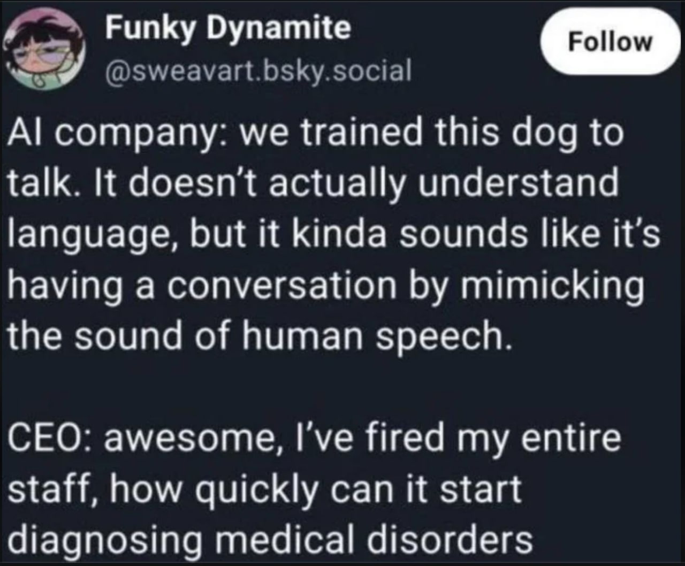

* Поиск работы в IT с помощью LLM
Без привлечения внимания санитаров

* Кто я и зачем мы здесь

- Андрей Кравчук, software engineer, 17 лет в +дурке+ индустрии
  * https://awkravchuk.me
- Последние полгода *каждый день* использую LLM в работе
- С прошлого месяца *ищу работу* — и применяю LLM в поиске
- Этот доклад — мой личный опыт + обзор индустрии

* Будущее профессии

* Куда катится индустрия
- Vibe coding → *agentic engineering* (2025→2026)
- Андрей Карпатый:
  «Новая норма — вы не пишете код 99% времени.
  Вы *дирижируете агентами*, которые это делают, и осуществляете надзор»
- Исследования:
  - Uplevel: в коде с ИИ — на 41% больше багов
  - METR: разрабы с ИИ на 19% *медленнее* (им казалось, быстрее)
  - IBM: только 2.6% опытных разрабов «полностью доверяют» ИИ-коду

Источники:
- [[https://x.com/karpathy/status/1886192184808149383][Karpathy: vibe coding (фев 2025)]]
- [[https://x.com/karpathy/status/2019137879310836075][Karpathy: agentic engineering (фев 2026)]]
- [[https://uplevelteam.com/blog/ai-for-developer-productivity][Uplevel]]
- [[https://metr.org/blog/2025-07-10-early-2025-ai-experienced-os-dev-study/][METR]]
- [[https://www.ibm.com/think/topics/agentic-engineering][IBM]]

* Куда катится индустрия

* Что обесценивается vs что дорожает

/Обесценивается:/
- написание бойлерплейта
- трансляция спецификаций в код (ключевая задача джуна)
- запоминание синтаксиса и API
- ручной дебаг простых ошибок

/Становится в 10 раз ценнее:/
- системная архитектура
- написание спецификаций
- ревью и критическое мышление
- оркестрация агентов
- *контекст-инжиниринг* (замена промпт-инжиниринга)

* Формула выживания

#+begin_quote
senior + LLM > senior без LLM

junior + LLM > junior без LLM

junior + LLM ≠ senior
#+end_quote

- Гарвард: занятость на junior-позициях упала на 20% (конец 2022 —
  середина 2025)
- Но IBM и Cognizant, наоборот, /увеличивают/ найм новичков, которые *сразу учатся работать с ИИ-агентами*
- Не учитесь кодить как в 2020, учитесь *дирижировать* как в 2026

* Мой кейс: TypeScript/React с нуля до прода

- Компания Health Samurai, платформа Aidbox FHIR
- Задача: админка на TypeScript/React для сотен пользователей
- *Мой предыдущий опыт в TS/React: 0 дней*
- Результат: доехал до прода через LLM-assisted development
- В резюме: «Delivered production-quality frontend with no prior commercial experience in either framework through LLM-assisted development» — и это *не стыдно*, это конкурентное преимущество

#+begin_quote
LLM не заменит вас. Но человек, который умеет
работать с LLM, заменит того, кто не умеет.
#+end_quote

* LLM — Large Language Model

- Нейросеть, обученная на *терабайтах текста*
- Миллиарды параметров, сотни миллионов долларов на обучение
- По сути: получает цепочку токенов → генерирует цепочку токенов
- Обучение: претрейн → instruction-tuning → RLHF (оптимизация под
  предпочтения человека)
- *Не обладает сознанием*, не «думает» — но выглядит очень убедительно

* Что умеет LLM

- Писать код (и объяснять его)
- Переводить, суммаризировать, анализировать текст
- Отвечать на вопросы (иногда правильно!)
- /Галлюцинировать/ — уверенно генерировать выдуманную информацию
- Порядок инструкций в промпте может влиять на качество ответа
- Работает лучше, если предложить деньги, нажать на жалость,
  наорать матом (без шуток — это потому что обучение на интернете)

* Контекст и контекстное окно

- *Контекст* — весь текст, который модель «видит» в данный момент: промпт + история диалога + прикреплённые файлы + системные инструкции
- Всё это *токенизируется*
- Токен — базовая единица текста, одна буква, целое слово или часть слова. Rule of thumb для английского: 1 токен ≈ 4 символа ≈ ¾ слова. На русском один и тот же текст может занимать в 2-3 раза больше токенов
- *Контекстное окно* — максимальное число токенов, которое модель может обработать за один раз
  - GPT-4o: ~128K токенов
  - Claude Sonnet: ~200K токенов
  - Gemini 2.5 Pro: ~1M токенов
- Когда контекст заканчивается, модель *забывает* самое старое
- Есть механизм *компактификации*
- Практический вывод: *самое важное ставьте в конец* промпта

* Провайдеры LLM

- *Провайдер* — сервис, который даёт доступ к моделям по API
- Платные:
  - [[https://anthropic.com][Anthropic]] — Claude Sonnet, Claude Opus
  - [[https://openai.com][OpenAI]] — GPT-4o, GPT-5, o3
  - [[https://ai.google][Google]] — Gemini
  - [[https://openrouter.ai][OpenRouter]] — агрегатор, 100+ моделей через один API
- Бесплатные / локальные:
  - [[https://ollama.com][Ollama]] — запускает модели на *вашей* машине, без интернета
  - DeepSeek, Qwen, Llama — open-source модели через тот же Ollama
- Большинство инструментов позволяют подключить *любого* провайдера

* Персональный фаворит: Z.AI

- Китайская компания [[https://z.ai][Z.AI]] (Zhipu AI), разработчик моделей GLM
- [[https://glm5.net][GLM-5]] — 744B параметров, 40B активных (MoE), open-source
- GLM-5.1 — лидер среди open-source моделей на SWE-bench Pro (58.4%)
- Удобство: фиксированная оплата
- На данный момент Lite $16/mo, Pro $65/mo
- Пользуюсь лично
  * Реферальная ссылка: ✨ https://z.ai/subscribe?ic=XBRRVA469M ✨
    1. Сначала регистрируемся на https://chat.z.ai/auth
    2. Потом прожимаем https://z.ai/subscribe?ic=XBRRVA469M
    3. Наслаждаемся 10% скидкой 😊

* Машина думает

- В ChatGPT есть переключатель «Thinking», в выхлопе Z.AI видно
  постоянные "Wait, actually", Claude показывает ход мыслей
- Это *thinking mode* — аналог chain-of-thought prompting, но встроенный в саму модель: она генерирует цепочку промежуточных рассуждений
  (reasoning tokens) перед финальным ответом
- Потребляет гораздо больше токенов и времени, но качество ответа
  *значительно* выше на сложных задачах — математика, логика, код
- У разных провайдеров по-разному:
  - OpenAI: o3, o4-mini — reasoning models
  - Anthropic: extended thinking в Claude
  - Z.AI: turn-level thinking
- Практический совет: для простых задач thinking не нужен —
  только лишние токены.
  Для сложных (архитектура, дебаг, незнакомый стек) — включайте

* Важное замечание про русский язык

- Модели заметно *тупеют* на русском языке
- Обучающая выборка преимущественно на английском
- Рекомендация: пишите промпты на английском
- AGENTS.md, комментарии, документацию для агента 💯 на английском

* Агенты

- LLM-агент — система, которая *взаимодействует со средой*
  для выполнения задачи
- Пример: агент с доступом в интернет → разбивает запрос на подзапросы → ищет → анализирует → синтезирует ответ
- Кодинг-агент: читает файлы → понимает проект → пишет/меняет код → запускает тесты → фиксит ошибки
- Компактификация и context management
- Claude Code, OpenCode, Cursor, Codex, ECA, ...

[[file:compiling.png]]

* MCP — Model Context Protocol

- Открытый протокол для подключения *внешних инструментов* к LLM
- Аналогия: как LSP (Language Server Protocol) стандартизировал
  автодополнение и навигацию, так MCP стандартизирует доступ агентов к данным и сервисам
- Примеры MCP-серверов:
  - [[https://github.com/exa-labs/exa-mcp-server][exa-mcp-server]] — поиск в интернете, заточенный под LLM ([[https://exa.ai][exa.ai]])
  - [[https://github.com/tickernelz/mcp-web-search][@zhafron/mcp-web-search]]  — поиск в интернете + скачивание файлов
    - см. тж. [[https://docs.searxng.org][SearXNG]]
  - [[https://github.com/stickerdaniel/linkedin-mcp-server][linkedin-scraper-mcp]] — работа с LinkedIn
  - [[https://github.com/shinzo-labs/gmail-mcp][@shinzolabs/gmail-mcp]] — работа с почтой GMail
  - chrome-devtools-mcp — манипулирование браузером
  - postgres-mcp — запросы к БД
  - github-mcp-server — работа с Github repos/issues/PRs
- Где искать: https://mcpmarket.com, https://mcpservers.org

* ECA — Editor Code Assistant

- https://eca.dev
- *Бесплатный, open-source* агент для *любого* редактора
- Работает с любым провайдером: Z.AI, Anthropic, OpenAI, Ollama, ...
- Поддерживает: Emacs, VS Code, IntelliJ, Neovim,
  есть отдельный Desktop-клиент
- Один конфиг — одинаковый опыт везде
- Skills, Agents, Subagents, MCP, Hooks, Plugins
- Написан на ✨ Clojure ✨

* Главная идея: Spec-Driven Development

#+begin_quote
идея → спецификация → план → декомпозиция → код → проверки
#+end_quote

- Когда код становится дешёвым, *самыми дорогими* становятся намерение и контроль качества
- Vibe coding — отличный ускоритель для прототипов и скриптов
- Но для всего, что должно жить долго: *сначала фиксируем намерение, потом реализуем*
- Аналогия из 60-х: инженеры не доверяли компиляторам, писали на ассемблере. Потом появились тесты, статический анализ, CI/CD — и мы научились доверять. С ИИ — та же история

* Лучшие практики промпт-инжиниринга

1. *Конкретность и структура* — промпт должен быть конкретен, последователен, подробен, структурирован
2. *Chain-of-thought* — попросите модель «решить задачу шаг за шагом» — качество ответа резко улучшается
3. *Few-shot prompting* — дайте 3-5 примеров того, что вы ожидаете
4. *Негативные промпты* — явно указывайте, чего делать *НЕ надо*

Из личного опыта:
- помнить, что вы в *диалоге*
- очень любят markdown
- есть внутренняя модель файла, после ручных правок просить перечитать
- начинаем с подробных душных описаний, в процессе работы можно короче ("этот файл")
- не стесняться пользоваться откатами

* Паттерн: To-Do List

- Используется *всеми* серьёзными кодинг-агентами
- Решает проблему *дрейфа целей* — LLM забывает, что делала, в середине длинной задачи
- Механизм: постоянно обновляя to-do, агент помещает актуальный план в конец контекста
  — это *целенаправленное управление вниманием*

* Антипаттерны

- ❌ *Копипастить не читая* — модель уверенно генерирует бред
- ❌ *Давать расплывчатые инструкции* — «сделай нормально» не работает
- ❌ *Не проверять тестами* — ИИ-код на 41% больше багов
- ❌ *Тратить время на ручной поиск* вместо того, чтобы
  дать агенту контекст
- ❌ *Доверять критическим решениям без верификации*
- ❌ *Пихать секреты и API-ключи в промпты*

* Memory Bank — «мозг» проекта для агента

- Проблема: контекстное окно LLM ограничено
- Решение: структурированная база знаний о проекте
- CLAUDE.md, AGENTS.md, .cursorrules — всё это примеры Memory Bank
- Содержит: бизнес-контекст, техстек, стандарты кодирования,
  архитектурные паттерны
- Агент читает Memory Bank перед началом каждой задачи
- Принцип самообновления: агент не только читает, но и может
  по просьбе писать Memory Bank

* Поиск работы: курс Hello New Job

- Автор: *Кира Кузьменко* — IT-рекрутер 15+ лет, фаундер NEWHR, подкаст «Собес»
- 7 недель, онлайн, старт X потока — июнь 2026
- Для всех IT-специальностей и грейдов (джун → топ-менеджер), Россия + международный рынок
- Программа:
  - Анализ рынка и стратегия поиска
  - Резюме, LinkedIn, сопроводительные письма. С фидбеком и прожарками
  - Самопрезентация и mock-интервью на русском и английском
  - Нетворкинг, реферальная система, закрытое комьюнити
- Тариф «База»: 46 900₽, «Fast Track» (индивидуальный ментор): 90 900₽
- Ссылка: [[https://hellonewjob.org][hellonewjob.org]]

* «Теневой» поиск работы

- Классический отклик на вакансии работает *всё хуже*
- Что реально работает: *личный контакт* с HR / специалистами /
  менеджерами в целевой компании
- LinkedIn — главный инструмент для нетворкинга
- Vas3k.club, Telegram-чаты, личный Telegram-канал
- Open-source как способ показать себя, профильные сообщества
- Многие позиции *никогда не попадают* на публичные доски вакансий
- HR получает сотни откликов — ваш теряется
- Личный контакт = вы уже прошли фильтр «адекватный человек»
- LLM помогает: персонализированные сообщения, адаптированное резюме, подготовка к интервью

* Скиллы для резюме

- *work-experience* — переписывает описания опыта в формат
  достиженческих буллетов по XYZ-фреймворку
  * «Достиг [X], измеренного в [Y], путём [Z]»
  * Пример: «Разработал систему» → «Разработал систему, обрабатывающую 1000+ запросов/сек, что сократило затраты на €50K/год»
- *adapt-resume* — адаптирует всё резюме под конкретную вакансию
- *DEMO TIEM*:
  - AGENTS.md как контекст для агента
  - Skill work-experience для переписывания буллетов
  - Skill adapt-resume для адаптации под конкретную вакансию

* ✨ E M A C S ✨

#+begin_quote
В мире существует ровно четыре текстовых редактора,
это ed, sed, vim и emacs, и если вы редактируете текст
не одним из них, вы точно делаете это не так.
— анонимный мудрец с имиджборд
#+end_quote

Этот доклад готовился в Emacs с помощью ECA и заечки,
которая мне помогла и с резюме, и с самой презентацией 😊

* Что сделать прямо сегодня

1. Приобрести подписку [[https://z.ai/subscribe?ic=XBRRVA469M][z.ai]]
2. Установить [[https://eca.dev][ECA]] в вашу IDE
3. Настроить MCP для веб-поиска, почты и LinkedIn
4. Создать репозиторий для поиска резюме
5. Приобрести курс [[https://hellonewjob.org][Hello New Job]]
6. *Не бояться*: LLM это инструмент, а не замена человека

* Вопросы, пожелания, предложения, угрозы, оскорбления?

